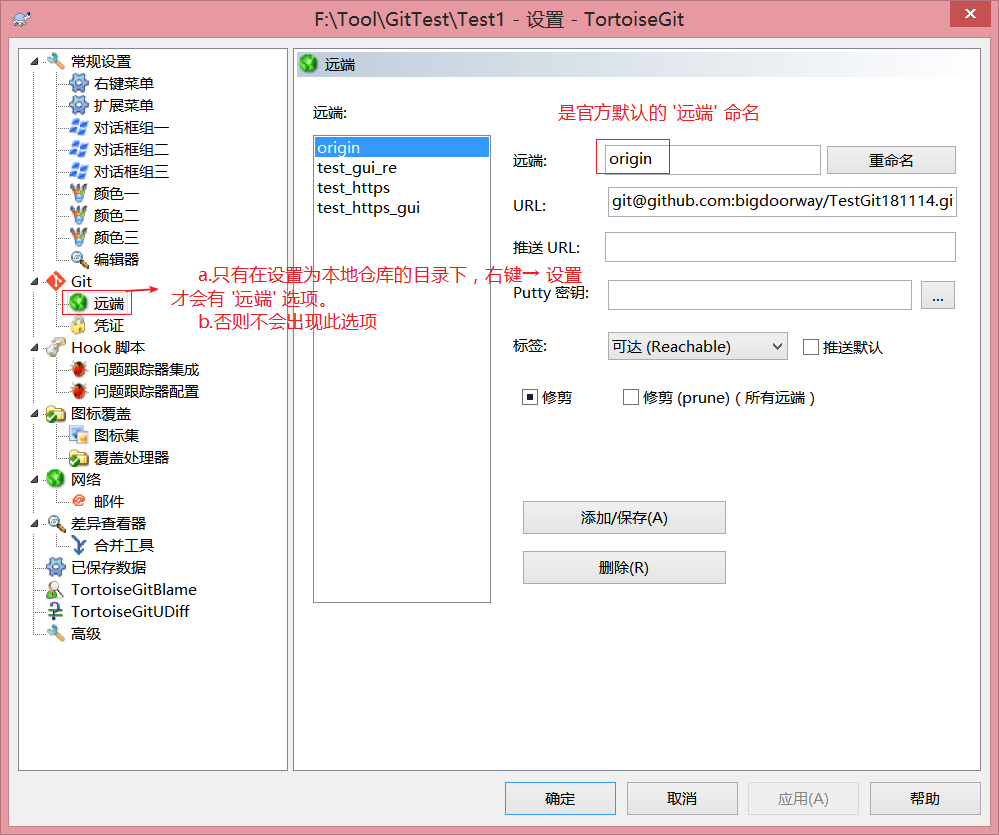

## 一、git的介绍

```
git是一个版本控制管理工具，区别于svn的集中式版本控制，是一个分布式的版本控制工具
```

## 二、git的本地操作

```
git安装软件
   git本地服务
   git 客户端
   git 中文语言包
git本地仓库操作
   命令行创建 git init
   图形化工具创建
   git客户端右键创建
git本地的操作
   add 添加新文件到暂存区
   commit  提交新代码或者暂存区 到仓库
   revert  还原未提交代码
           还原已提交代码  show log --> 版本右键选'重置到此版本'选项
                                  soft  只还原暂存区
                                  mixed 本地不还原 还原仓库
                                  hard  本地和仓库一起还原 ----日常使用
   delete  删除本地提交 删除本地和仓库
           删除保留副本 提交 删除仓库留本地

```

**Git和SVN设置被管理的目录的区别：

```
Git在本地目录设置为版本控制的方式：
① Git设置仓库直接右键选择在此目录设置仓库即可；
② 克隆一个项目

SVN在本地目录设置为版本控制的方式：
① SVN设置仓库需要先连接服务器，从SVN服务器第一次下载操作是检出项目，下载的项目目录被SVN管理。check out
② 第一次上传到SVN服务器的已经创建好的目录里--在Idea里做Share Project

***Git和SVN的操作都是一样，需要先在Git远端服务器或者SVN服务器创建仓库***
```

## 三、远端仓库的操作

```
**Git和SVN一样，一切操作的开始前需要先在远端共享服务器上创建仓库**
```

```
注意：Git的一些操作远端共享残酷区别于SVN的服务器仓库操作
1.从远端共享仓库获取项目或操作项目注意
Git
a. Git获取一个远端共享仓库的项目需要先获取指定的远端仓库的地址SSH地址或者Https地址。
b. 然后在本地的仓库目录下右键设置→ 远端选项，设置一个远端地址。
--此后所有的与远端服务器相关的操作都选这个 ‘远端’地址，操作远端服务器的共享仓库。
c. 远端地址设置
   设置远端地址用于push上传至远端仓库，因为在开源下clone克隆获取和pull拉取是免费无限制的。
I、在图形化设置界面设置/添加一个'远端'仓库地址
-GitHub为远端共享仓库 
  SSH地址：  git@github.com:bigdoorway/secondTest.git
  Https地址：https://github.com/bigdoorway/testHttps.git 
-Linux私服为远端共享仓库 
  SSH地址：  ssh://git@192.168.129.131/home/git/private_git_directory_test
II、使用命令行给当前仓库添加一个'远端'仓库地址
**注意'远端'的命名不能重复。
-GitHub为远端共享仓库 
  命令格式：
   git remote add '远端自定义命名'  从Github获取的https/ssh地址
  示例：
   git remote add origin https://github.com/bigdoorway/testHttps.git
   git remote add origin git@github.com:bigdoorway/secondTest.git
III、使用命令方式做push推送操作
   格式：git push -u '设置的远端名' 远端仓库的分支
   示例：git push -u origin master
IV、使用命令行方式做clone克隆获取操作
   格式：git clone ssh/https地址
   示例：git clone git@github.com:bigdoorway/test_https_GUI.git
   	    git clone https://github.com/bigdoorway/test_https_GUI.git
```



### 1.推送和克隆远端仓库

```
远端仓库 作为多人协作开发的共享版本库
    github网站
    公司linux系统
1.远端仓库连接的方式
    
    ssh：  安全外壳协议   验证方式为公钥(服务器)和私钥（客户端）
    ----命令行推送代码到远端仓库-----
    1.创建验证的公钥和私钥
    2.输入命令推送本地工程代码 
       git remote 建立远端连接 origin为远端默认名称(可以自定义) 后面为github的仓库地址
       git remote add origin git@github.com:wygittest/git_first_69.git
       git push为推送命令 origin为上面添加的远端名称 master 默认的git主线名称
	   git push -u origin master
	-------客户端右键的推送远端-----
    1.需要配置远端的名称和路径 github远端仓库拷贝过来
    2.上传需要使用 客户端exe  git本地安装目录下的  ----D:\Git\usr\bin\ssh.exe
	   
	 https: 安全的http协议 验证方式为 账号密码
	 git remote add cmd_http_repo https://github.com/wygittest/cmd_https_repo.git
     要求输入注册githt的账号密码用于验证
 2.克隆远端代码到本地 无需验证
    git clone  具体的仓库地址
    git 图形化工具 右键 克隆仓库
```

### 2.多人操作远端代码示例

```
push 推送本地代码到远端
pull 拉取远端代码到本地
规则为： 先保证本地代码为已提交 然后再推送和拉取
如果冲突 先pull拉取代码 再push推送代码 冲突的版本代码合并后操作 
```

### 2.git的私有服务器作为远端仓库

```
1.运行yum命令 安装其余的辅助环境
  yum -y install curl curl-devel zlib-devel openssl-devel perl cpio expat-devel gettext-devel gcc cc
2.将资料中的git服务器安装包 上传到linux系统
3.将压缩包解压缩 命令为 tar -zxvf git-2.5.0.tar.gz
4.cd 进入到 git-2.5.0 目录
5.autoconf 执行命令 如果报错 先yum install autoconf
6./configure 配置安装的环境
7. make 编译安装源代码  如果报错 先运行 yum install perl-ExtUtils-CBuilder perl-ExtUtils-MakeMaker
8. make install 安装
-------配置私有git服务器的仓库---
1.创建操作git私有服务器仓库的用户 
  --添加用户名为 git
  adduser -r -c 'git version control' -d /home/git -m git
2.设置git用户的密码
  passwd git 
  输入自定义id密码 如果过短可以忽略继续输入  例子为：git用户名  密码为git
3.切换git用户创建仓库 
  su git
4.进入到git用户的目录下 
	cd /home/git
	cd ~
5.创建作为仓库的文件夹
  mkdir private_git
6.进入到 仓库目录 初始化仓库
  cd private_git
7.初始化仓库命令，即将当前目录设为一个git仓库
  git init --bare
  
```

## 四、git的分支操作

```
分支默认名称master
a.自定义分支名
b.通过右键 git 切换分支
c.合并指定的分支中的内容，默认是将此分支与指定分支不同的文件都会被合并过来
d.分支之间互相合并解决冲突
--分支A提交1.txt，分支B提交了1.txt，分支1要合并分支2，则1.txt必发生冲突，在发生冲突方解决冲突再提交即可
```

## 五、idea中操作git

```
1.创建工程交给版本库管理  vcs---import into version control---create Repository here
2.注意：选择的目录为当前项目的文件夹
3.add添加代码文件 commit 提交 revert 还原 还原历史 show history  ---get
----------idea中配置远端仓库操作--------
1.vcs--git--push---定义远端仓库地址
2.vcs--git--push 推送到远端仓库
3.vcs--git--pull 拉取远端到本地
4.如果冲突合并后 推送
----------idea中配置分支-----------
1.创建分支 vcs---git ---branches---自定义分支名
2.切换分支 vcs---git---branches---选择分支 ---check out
3.合并操作 vcs---git---merge---选择分支名
4.冲突解决 先解决冲突后提交 

```

